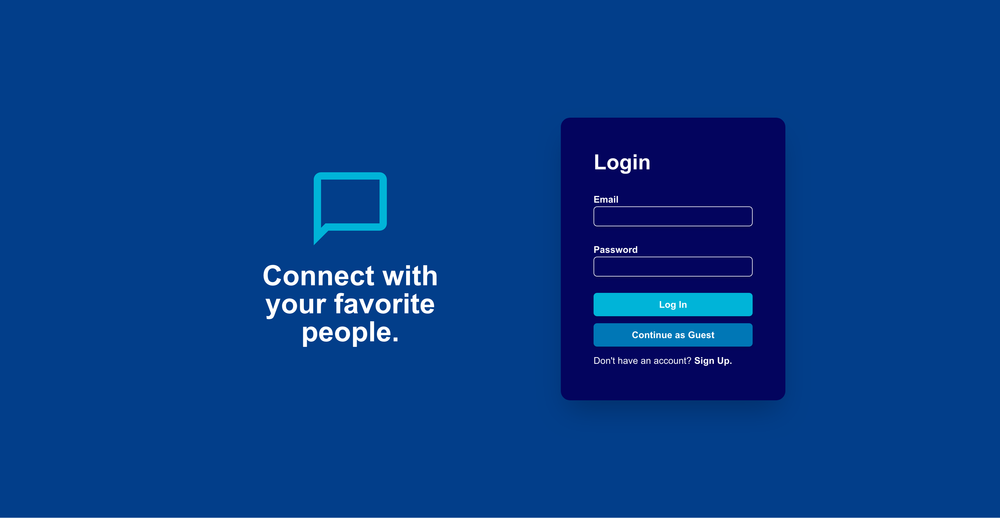

# **Messaging App with Firebase and Next.js**

This is my solution to building a real-time messaging app using Firebase and Next.js. The project required implementing authentication, real-time database updates, and a responsive UI. I built this from scratch, refining my skills in Firebase's Firestore, authentication, and state management with React and Tailwind CSS.

## **Overview**

### **The Challenge**
Users should be able to:

- Sign up and log in using Firebase Authentication.
- Send and receive messages in real time using Firestore's onSnapshot listeners.
- View a list of conversations and navigate between chats.

## **Screenshot**

## **Links**
- Live Demo: https://messaging-app-eta-lake.vercel.app (due to limited resources, the app may take up to a minute to start up)
- GitHub Repository: https://github.com/MikeBoguszewski/messaging-app

---

# **My Process**

## **Built With**

- **Next.js** - React framework with server-side rendering for better performance.
- **Firebase** - Authentication, Firestore database, and real-time updates.
- **Tailwind CSS** - Utility-first CSS framework for styling.
- **React Context API** - State management for authentication.

## **What I Learned**
This project significantly improved my understanding of Firebase and Next.js, particularly in:

- Using Firebase Authentication for secure user sign-up and login.
- Implementing Firestore's onSnapshot listeners to fetch and update messages in real time.
- Managing user sessions and authentication state with Firebase and React Context API.
- Building responsive UI components using Tailwind CSS.
- Handling async operations efficiently using React hooks and Firestore queries.
- Deploying a Next.js app with Firebase integration.
- Understanding GitHub workflows and feature branching to efficiently manage code changes and merge updates.

